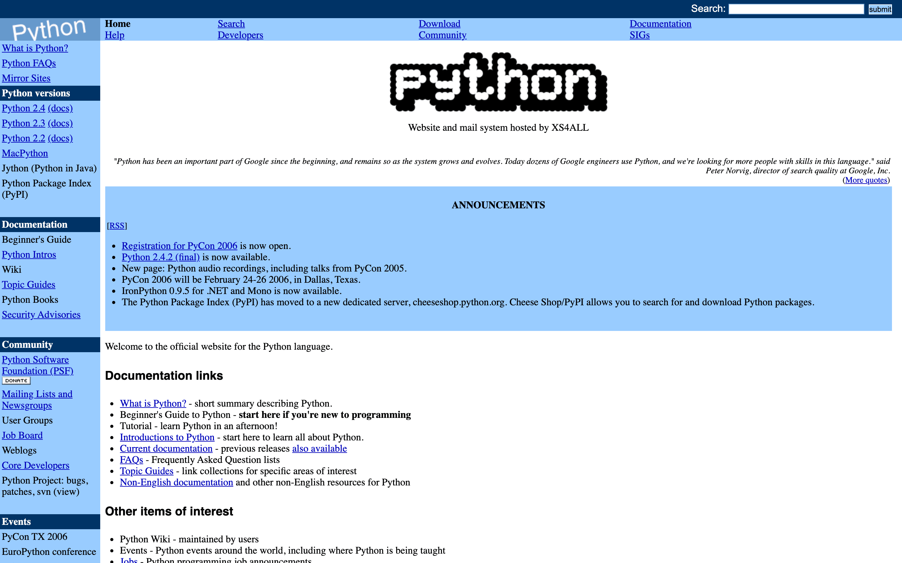
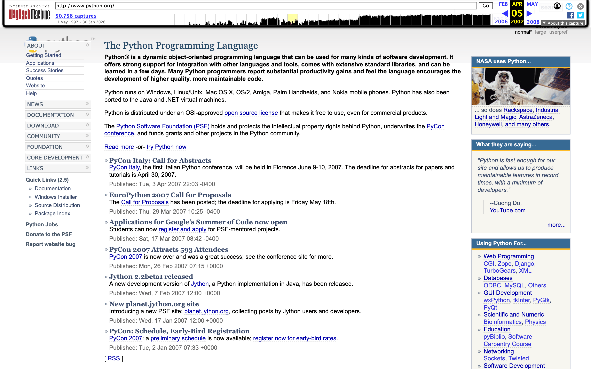
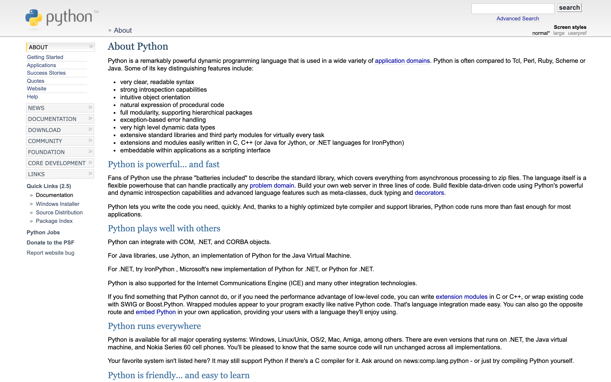
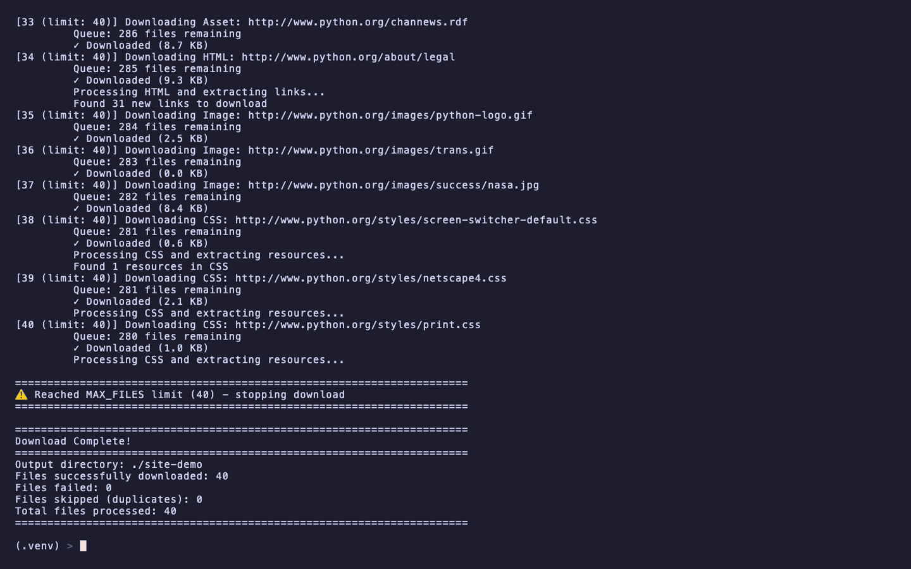
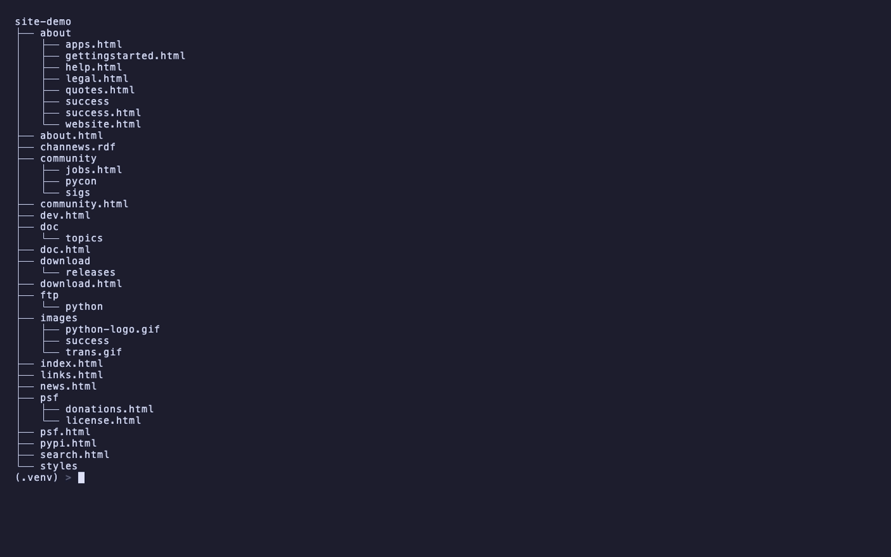
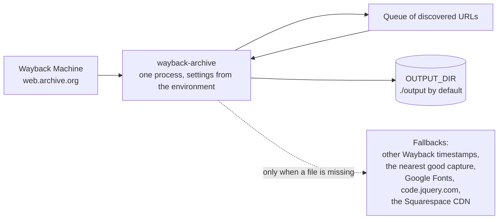

---
hide:
  - navigation
---

# Wayback-Archive { .wa-visually-hidden }

  

  
  
  
  
  

---

**Wayback-Archive** is a command-line tool that rescues a whole website from the [Wayback Machine](https://web.archive.org/). Give it one archived URL and you get a folder that opens in a browser and looks like the site did on that day: every page and asset the crawl can reach, links rewritten to the local copies, the Wayback Machine's toolbar and URL prefixes gone. It installs from PyPI in one command ([Getting started](getting-started.md)) and every setting is an environment variable ([Configuration](configuration.md)).

-   :material-download: **[Install](getting-started.md)**

    ---

    `pipx install wayback-archive`, or pip, or a checkout. Python 3.10 or newer.

-   :material-play-circle-outline: **[First run](usage.md)**

    ---

    One URL, one command, a quick test with `MAX_FILES`, and how to open the copy on macOS, Linux and Windows.

-   :material-tune: **[Configuration](configuration.md)**

    ---

    Every environment variable and its default: output folder, minification, trackers, links, www or not.

-   :material-cogs: **[How it works](how-it-works.md)**

    ---

    The crawl steps, the nearby-timestamp fallback and what the tool talks to.

## The result

A snapshot of python.org from April 2007, rescued with one command and opened from the copy. No Wayback toolbar, no `web.archive.org` in the links, the stylesheet and images served from the folder on disk.

<figure markdown>

<figcaption>Before: the snapshot on the Wayback Machine</figcaption>
</figure>
<figure markdown>

<figcaption>Links inside the copy lead to rescued pages</figcaption>
</figure>
<figure markdown>

<figcaption>The run, and what success looks like</figcaption>
</figure>
<figure markdown>

<figcaption>The folder you get</figcaption>
</figure>

## What it saves

- Every page and asset the crawl can reach from the URL you give it: HTML, CSS, JavaScript, images and fonts. Links are followed in HTML, in CSS (`@import`, `url()`) and in JavaScript.
- Links rewritten to relative paths, so pages open from the folder and lead to each other without touching the Wayback Machine again.
- Pages and files the snapshot is missing, when one of up to three other Wayback timestamps (a day either side and a week earlier) has them. A capture that is an archived error or a Cloudflare challenge page is replaced with the nearest good capture.
- Google Fonts, saved locally so text renders offline. A font file the archive returns as an HTML error page is dropped instead of breaking the stylesheet.
- jQuery, when the archive lost it, fetched from `code.jquery.com` so the page still works.
- Social icon groups, button links and cookie banners, kept working in the copy.
- URLs held in `data-*` attributes, such as lazy-loaded images and videos.

Analytics and ads are removed by default (`REMOVE_TRACKERS`, `REMOVE_ADS`); external iframes only when `REMOVE_EXTERNAL_IFRAMES=true`. Optional minification of HTML, CSS, JavaScript and images makes the folder smaller. The full list is on [Features](features.md), with the comparison against `wget --mirror` and `httrack`.

## How it runs

1. The page at `WAYBACK_URL` is fetched first.
2. Its HTML, CSS and JavaScript are parsed for links and every new URL joins the queue.
3. Each queued file is downloaded, parsed the same way, rewritten and written under `OUTPUT_DIR`.
4. A 404 from the archive is retried at up to three other timestamps. A file still missing is fetched live only when it is hosted on Google Fonts, `code.jquery.com` or the Squarespace CDN; anything else is counted as failed.
5. When the queue is empty the run prints a `Download Complete!` block with the files downloaded, failed and skipped.

`MAX_FILES` stops the crawl after trying that many files, failed ones included, which is the way to try a big site without waiting for all of it. The crawl fetches files in the order it finds them, so a short run can miss a stylesheet the full run saves. There are no command-line flags: `wayback-archive --help` prints `Error: WAYBACK_URL environment variable is required`. Settings come from the environment or a `.env` file in the working directory. See [How it works](how-it-works.md) for the steps in detail and [Configuration](configuration.md) for every variable.

## What it does not do

- It reads the Wayback Machine only. A live site is not a valid `WAYBACK_URL`; for live sites use `wget`, `httrack` or [web-mirror](https://github.com/GeiserX/web-mirror).
- It never fetches the archived site's own domain, or any other host, from the live Internet, with three exceptions: Google Fonts, `code.jquery.com` and Squarespace's CDN, and only for a file the archive lacks. Other external links stay external in the copy.
- It cannot rebuild what the archive never captured. A page missing at every nearby timestamp is counted under `Files failed` and its links stay broken.
- It has no resume. A run interrupted with Ctrl-C leaves what it wrote in `OUTPUT_DIR`; the next run starts from the first URL again.
- It does not run JavaScript. Content a page loaded at runtime from an API is not discovered unless its URL appears in the page's HTML, CSS, JavaScript or `data-*` attributes.

## Privacy

- The tool contacts `web.archive.org`, and only when a file is missing there, `fonts.googleapis.com` and `fonts.gstatic.com` for a Google Font, `code.jquery.com` for jQuery, or the Squarespace CDN for a file hosted there. It sends nothing anywhere else and has no telemetry.
- Analytics and tracker scripts and ads are removed while the pages are rewritten (`REMOVE_TRACKERS` and `REMOVE_ADS`, both on by default). External iframes, such as an embedded video, stay in the copy and load from the network unless `REMOVE_EXTERNAL_IFRAMES=true`. `REMOVE_CLICKABLE_CONTACTS=true` (the default) also points `tel:` and `mailto:` links at `#`.
- The output is plain files on your disk. Nothing is uploaded.

## Getting help

- If a page looks wrong, read [Troubleshooting](troubleshooting.md) first: fonts, missing icons and libraries that do not load are the usual causes.
- Open an [issue](https://github.com/GeiserX/Wayback-Archive/issues) with the `WAYBACK_URL`, the tail of the run's output including the `Download Complete!` block, and your Python version.
- [Releases](https://github.com/GeiserX/Wayback-Archive/releases) list what changed in each version.
- To send a fix, read [Development](development.md).

## License

Wayback-Archive is released under the [GPL-3.0-or-later](https://github.com/GeiserX/Wayback-Archive/blob/main/LICENSE) license.
